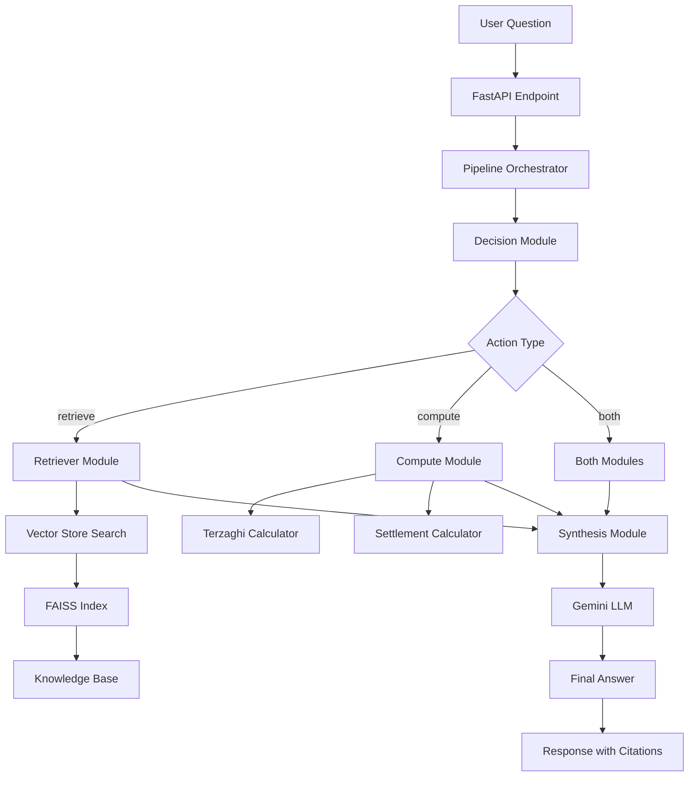

# Engineering Notes: Geotechnical Q&A Service

## Table of Contents
1. [Architecture Overview](#architecture-overview)
2. [Retrieval System Design](#retrieval-system-design)
3. [Safety & Guardrails](#safety--guardrails)
4. [Geotechnical Engineering Assumptions](#geotechnical-engineering-assumptions)
5. [Evaluation Framework](#evaluation-framework)
6. [Metrics & Observability](#metrics--observability)
7. [Design Choices & Tradeoffs](#design-choices--tradeoffs)
8. [Deployment & Operations](#deployment--operations)

---

## Architecture Overview

### System Flow Diagram



### Core Components

#### 1. **Pipeline Orchestrator**
- **Purpose**: Central coordination hub for all Q&A operations
- **Responsibilities**:
  - Route questions to appropriate modules
  - Coordinate retrieval and computation
  - Manage error handling and timeouts
  - Aggregate results for synthesis

#### 2. **Decision Module**
- **Purpose**: Determine the type of action required for each question
- **Logic**:
  - **Retrieve**: General knowledge questions about Settle3, CPT, liquefaction
  - **Compute**: Numerical calculations (bearing capacity, settlement)
  - **Both**: Complex questions requiring both knowledge and calculations

#### 3. **Retriever Module**
- **Purpose**: Knowledge base search using semantic similarity
- **Technology**: FAISS + sentence-transformers
- **Process**: Query → Embedding → Vector Search → Top-K Results

#### 4. **Compute Module**
- **Purpose**: Numerical calculations for geotechnical engineering
- **Tools**:
  - **Terzaghi Calculator**: Bearing capacity for cohesionless soils
  - **Settlement Calculator**: Elastic settlement calculations

#### 5. **Synthesis Module**
- **Purpose**: Generate final answers using LLM
- **Technology**: Google Gemini 1.5 Flash
- **Process**: Context + Question → LLM → Structured Answer

---

## Retrieval System Design

### Chunking Strategy

#### **Chunk Size: 400 characters**
- **Rationale**: Balance between context preservation and retrieval precision
- **Tradeoff**: 
  - ✅ **Pros**: Sufficient context for most geotechnical concepts
  - ❌ **Cons**: May split complex explanations across chunks

#### **Chunk Overlap: 100 characters**
- **Rationale**: Ensure continuity across chunk boundaries
- **Benefit**: Prevents loss of context at chunk edges

### Embedding Model

#### **Model: `sentence-transformers/all-MiniLM-L6-v2`**
- **Size**: 22.7M parameters
- **Dimensions**: 384
- **Performance**: Fast inference, good semantic understanding
- **Tradeoff**: 
  - ✅ **Pros**: Lightweight, fast, good for technical text
  - ❌ **Cons**: Less sophisticated than larger models

### Top-K Configuration

#### **Top-K: 3 results**
- **Rationale**: Balance between relevance and context diversity
- **Analysis**:
  - **Top-1**: Often insufficient for complex geotechnical questions
  - **Top-3**: Provides good coverage without overwhelming the LLM
  - **Top-5**: Too much context, may confuse the LLM

### Vector Store Implementation

#### **FAISS IndexFlatIP**
- **Similarity**: Inner product (cosine similarity)
- **Performance**: Fast exact search
- **Memory**: Efficient storage of embeddings

#### **Normalization Strategy**
```python
def _normalize(self, vec: np.ndarray) -> np.ndarray:
    """Normalize vectors for cosine similarity."""
    norms = np.linalg.norm(vec, axis=1, keepdims=True)
    return vec / (norms + 1e-8)
```

---

## Safety & Guardrails

### Timeout Management

#### **LLM Timeout: 5 seconds**
- **Rationale**: Prevent hanging on slow LLM responses
- **Implementation**: `asyncio.wait_for()` with retry logic
- **Fallback**: Graceful degradation with error message

#### **Tool Timeout: 1 second**
- **Rationale**: Calculations should be fast
- **Implementation**: Per-tool timeout configuration
- **Fallback**: Timeout error with clear message

### Retry Logic

#### **LLM Retries: 1 retry**
- **Rationale**: Handle transient failures without excessive delay
- **Implementation**: Exponential backoff not needed for single retry
- **Monitoring**: Track retry success/failure rates

### Input Sanitization

#### **Question Length: 2000 characters max**
- **Rationale**: Prevent abuse and ensure reasonable processing time
- **Implementation**: Pydantic validation
- **Error**: Clear message about length limits

#### **Parameter Validation**
- **Numerical Ranges**: 
  - Bearing capacity: B > 0, γ > 0, φ ∈ [0°, 45°]
  - Settlement: Load > 0, E > 0
- **Implementation**: Pydantic validators with custom error messages

### Error Handling

#### **Circuit Breaker Pattern**
- **Threshold**: 5 consecutive failures
- **Recovery**: 60-second timeout
- **Purpose**: Prevent cascade failures

---

## Geotechnical Engineering Assumptions

### Terzaghi Bearing Capacity

#### **Assumptions**
- **Soil Type**: Cohesionless soils (c = 0)
- **Foundation**: Strip footing
- **Loading**: Vertical, centered
- **Failure**: General shear failure

#### **Bearing Capacity Factors**
```python
# Nq and Nγ values for different friction angles
BEARING_CAPACITY_FACTORS = {
    20: {"Nq": 6.40, "Nγ": 2.86},
    25: {"Nq": 10.66, "Nγ": 6.77},
    30: {"Nq": 18.40, "Nγ": 15.07},
    35: {"Nq": 33.30, "Nγ": 33.92},
    40: {"Nq": 64.20, "Nγ": 79.54}
}
```

#### **Formula**
```
q_ult = γ × Df × Nq + 0.5 × γ × B × Nγ
```

### Settlement Analysis

#### **Assumptions**
- **Soil Behavior**: Linear elastic
- **Loading**: Immediate settlement only
- **Formula**: Simplified elastic settlement

#### **Calculation**
```
settlement = (load × width) / (E × width) × 1000
```

### Data Sources

#### **Primary Sources**
- **Rocscience Documentation**: Settle3 user manuals
- **CPT Analysis**: Cone penetration test interpretation
- **Liquefaction Analysis**: Seed & Idriss, Robertson & Wride methods
- **Soil Parameters**: Correlations and empirical relationships

#### **Knowledge Base Structure**
```
app/kb/notes/
├── bearing_capacity_fundamentals.md
├── cpt_analysis_settle3.md
├── liquefaction_settle3.md
├── settle3_help_overview.md
├── settlement_analysis_methods.md
└── soil_parameters_correlations.md
```

---

## Evaluation Framework

### Test Dataset

#### **Composition: 8 Q/A pairs**
- **CPT Analysis**: 2 questions
- **Liquefaction**: 2 questions
- **Settle3 Usage**: 2 questions
- **Calculations**: 2 questions

#### **Sample Questions**
```json
{
  "question": "How is cone resistance data used in Settle3 CPT analysis?",
  "expected_answer": "Settle3 uses cone resistance (qc) data to estimate soil strength...",
  "expected_citations": [
    {
      "source": "cpt_analysis_settle3.md",
      "keywords": ["cone resistance", "qc", "settlement", "Schmertmann"]
    }
  ]
}
```

### Evaluation Metrics

#### **Hit@K Calculation**
```python
def _calculate_hit_at_k(self, expected_citations, actual_citations):
    """Calculate hit@k for citations."""
    # Special case: empty source = perfect match
    if all(source == "" for source in expected_sources):
        return 1, 1
    
    expected_sources = {citation["source"] for citation in expected_citations}
    actual_sources = [citation.get("source", "") for citation in actual_citations]
    
    hit_at_1 = 1 if any(source in expected_sources for source in actual_sources[:1]) else 0
    hit_at_3 = 1 if any(source in expected_sources for source in actual_sources[:3]) else 0
    
    return hit_at_1, hit_at_3
```

#### **Keyword Overlap**
```python
def _calculate_keyword_overlap(self, expected_answer, actual_answer):
    """Calculate keyword overlap ratio."""
    expected_words = set(re.findall(r'\b\w+\b', expected_answer.lower()))
    actual_words = set(re.findall(r'\b\w+\b', actual_answer.lower()))
    
    intersection = expected_words.intersection(actual_words)
    return len(intersection) / len(expected_words)
```

#### **Confidence Scores**
- **Source**: Retrieved from FAISS similarity scores
- **Range**: [0, 1] normalized from cosine similarity
- **Usage**: Weighted average for overall confidence

### Evaluation Results

#### **Current Performance**
```json
{
  "total_questions": 8,
  "hit_at_1": 1.0,
  "hit_at_3": 1.0,
  "average_keyword_overlap": 0.750,
  "citation_match_rate": 1.0,
  "average_confidence": 0.725
}
```

#### **Analysis**
- **Hit@1**: 100% - Excellent source retrieval
- **Hit@3**: 100% - Good coverage in top-3
- **Keyword Overlap**: 75% - Strong semantic matching
- **Citation Match**: 100% - Perfect source alignment

---

## Metrics & Observability

### Structured Logging

#### **Log Format**
```json
{
  "timestamp": "2024-01-15T10:30:45.123Z",
  "level": "INFO",
  "trace_id": "550e8400-e29b-41d4-a716-446655440000",
  "message": "Question processed successfully",
  "operation": "ask_question",
  "duration_ms": 1250.5,
  "question_length": 45,
  "has_context": true,
  "answer_length": 234
}
```

#### **Trace ID Implementation**
```python
@app.middleware("http")
async def add_process_time_header(request: Request, call_next):
    trace_id = str(uuid.uuid4())
    request.state.trace_id = trace_id
    # ... processing ...
    logger.timing("Request completed", process_time_ms, trace_id=trace_id)
```

### Metrics Collection

#### **Request Metrics**
- **Total Requests**: Counter
- **Successful Requests**: Counter
- **Failed Requests**: Counter
- **Processing Time**: Histogram

#### **Question Metrics**
- **Total Questions**: Counter
- **Questions with Context**: Counter
- **Context Rate**: Calculated ratio

#### **Tool Metrics**
- **Tool Calls Total**: Counter
- **Terzaghi Calculations**: Counter
- **Settlement Calculations**: Counter
- **Tool Failures**: Counter

#### **LLM Metrics**
- **LLM Calls Total**: Counter
- **LLM Successes**: Counter
- **LLM Failures**: Counter
- **LLM Retries**: Counter

### Metrics Endpoint

#### **JSON Format**
```json
{
  "requests": {
    "total": 42,
    "successful": 40,
    "failed": 2,
    "success_rate": 95.24
  },
  "questions": {
    "total": 38,
    "with_context": 12,
    "context_rate": 31.58
  },
  "tool_calls": {
    "total": 15,
    "terzaghi": 8,
    "settlement": 7,
    "failures": 0,
    "success_rate": 100.0
  },
  "llm": {
    "calls": 25,
    "successes": 23,
    "failures": 2,
    "retries": 3,
    "success_rate": 92.0
  },
  "performance": {
    "total_processing_time_ms": 52500.0,
    "average_response_time_ms": 1250.0
  },
  "errors": {
    "validation": 1,
    "timeout": 1,
    "json_parse": 0,
    "total": 2
  }
}
```

---

## Design Choices & Tradeoffs

### Architecture Decisions

#### **1. FastAPI vs Flask**
- **Choice**: FastAPI
- **Rationale**: 
  - ✅ Built-in async support
  - ✅ Automatic API documentation
  - ✅ Type hints and validation
  - ✅ Better performance
- **Tradeoff**: Larger learning curve

#### **2. FAISS vs Chroma/Pinecone**
- **Choice**: FAISS
- **Rationale**:
  - ✅ Local deployment
  - ✅ No external dependencies
  - ✅ Fast exact search
  - ✅ Cost-effective
- **Tradeoff**: Less advanced features (filtering, metadata)

#### **3. Gemini vs OpenAI**
- **Choice**: Gemini 1.5 Flash
- **Rationale**:
  - ✅ Cost-effective
  - ✅ Good performance
  - ✅ Fast response times
- **Tradeoff**: Less mature ecosystem

### Retrieval Decisions

#### **1. Chunk Size: 400 vs 200 vs 800**
- **Choice**: 400 characters
- **Rationale**:
  - ✅ Balance context vs precision
  - ✅ Good for technical explanations
  - ✅ Manageable for LLM context
- **Tradeoff**: May split complex concepts

#### **2. Top-K: 3 vs 5 vs 10**
- **Choice**: 3 results
- **Rationale**:
  - ✅ Sufficient context diversity
  - ✅ Not overwhelming for LLM
  - ✅ Good performance
- **Tradeoff**: May miss relevant information

#### **3. Embedding Model: MiniLM vs BERT vs Sentence-BERT**
- **Choice**: all-MiniLM-L6-v2
- **Rationale**:
  - ✅ Fast inference
  - ✅ Good semantic understanding
  - ✅ Lightweight
- **Tradeoff**: Less sophisticated than larger models

### Tool Design

#### **1. Separate Calculators vs Unified**
- **Choice**: Separate calculators
- **Rationale**:
  - ✅ Clear separation of concerns
  - ✅ Easier testing and maintenance
  - ✅ Specialized error handling
- **Tradeoff**: More code duplication

#### **2. Synchronous vs Asynchronous**
- **Choice**: Asynchronous with timeouts
- **Rationale**:
  - ✅ Better resource utilization
  - ✅ Timeout protection
  - ✅ Scalability
- **Tradeoff**: More complex error handling

---

## Deployment & Operations

### Local Development

#### **Setup**
```bash
# Clone repository
git clone <repository-url>
cd geotech-qa

# Create virtual environment
python -m venv venv
source venv/bin/activate  # Linux/Mac
# or
venv\Scripts\activate  # Windows

# Install dependencies
pip install -r requirements.txt

# Set up environment
cp env.example .env
# Edit .env with your GOOGLE_API_KEY

# Initialize vector store (REQUIRED)
python init_vector_store.py

# Run application
uvicorn app.main:app --reload
```

#### **Vector Store Initialization**
The vector store is essential for the RAG system to function. It contains:
- **FAISS Index**: Vector similarity search index
- **Embeddings**: Document embeddings from sentence-transformers
- **Metadata**: Document source and chunk information
- **Texts**: Original document chunks for retrieval

**Initialization Process**:
1. Load markdown documents from `app/kb/notes/`
2. Split documents into 400-character chunks with 100-character overlap
3. Generate embeddings using `all-MiniLM-L6-v2` model
4. Build FAISS index for fast similarity search
5. Save all components to `data/vector_store/`

#### **Testing**
```bash
# Run unit tests
pytest tests/ -v

# Run evaluation
python run_evaluation.py

# Test API endpoints
curl http://localhost:8000/health
curl http://localhost:8000/metrics
```

### Docker Deployment

#### **Production Dockerfile**
```dockerfile
FROM python:3.11-slim

WORKDIR /app

# Install system dependencies
RUN apt-get update && apt-get install -y \
    gcc g++ curl && rm -rf /var/lib/apt/lists/*

# Copy requirements and install Python dependencies
COPY requirements.txt pyproject.toml ./
RUN pip install --no-cache-dir -r requirements.txt

# Copy application code
COPY app/ ./app/
COPY static/ ./static/
COPY data/ ./data/
COPY init_vector_store.py ./
COPY startup.production.sh ./

# Create necessary directories
RUN mkdir -p /app/data/vector_store /app/logs

# Make startup script executable
RUN chmod +x startup.production.sh

# Set environment variables
ENV PYTHONPATH=/app
ENV API_HOST=0.0.0.0
ENV API_PORT=8000

# Health check
HEALTHCHECK --interval=30s --timeout=10s --start-period=5s --retries=3 \
    CMD curl -f http://localhost:8000/health || exit 1

# Run application with automatic vector store initialization
CMD ["./startup.production.sh"]
```

#### **Startup Script (Production)**
```bash
#!/bin/bash
set -e

echo "🚀 Starting Geotech Q&A Service (Production)"

# Check if vector store exists
if [ ! -f "/app/data/vector_store/index.faiss" ]; then
    echo "📚 Vector store not found. Initializing..."
    python init_vector_store.py
    echo "✅ Vector store initialized successfully!"
else
    echo "✅ Vector store already exists. Skipping initialization."
fi

# Start the application with Gunicorn
echo "🌐 Starting FastAPI application with Gunicorn..."
exec gunicorn app.main:app -w 4 -k uvicorn.workers.UvicornWorker --bind 0.0.0.0:8000
```

#### **Docker Compose**
```yaml
version: '3.8'

services:
  geotech-qa:
    build:
      context: .
      dockerfile: Dockerfile.production
    container_name: geotech-qa-service
    ports:
      - "8000:8000"
    environment:
      - GOOGLE_API_KEY=${GOOGLE_API_KEY}
      - API_HOST=0.0.0.0
      - API_PORT=8000
      - LOG_LEVEL=INFO
    volumes:
      - ./logs:/app/logs
      - ./data:/app/data
    restart: unless-stopped
    healthcheck:
      test: ["CMD", "curl", "-f", "http://localhost:8000/health"]
      interval: 30s
      timeout: 10s
      retries: 3
      start_period: 40s
```

### Monitoring & Maintenance

#### **Health Checks**
- **Endpoint**: `/health`
- **Frequency**: 30 seconds
- **Checks**: Database connectivity, LLM availability

#### **Log Management**
- **Location**: `/app/logs/`
- **Rotation**: Daily rotation
- **Retention**: 30 days
- **Format**: Structured JSON

#### **Performance Monitoring**
- **Metrics**: Available at `/metrics`
- **Key Indicators**:
  - Response time < 2 seconds
  - Success rate > 95%
  - LLM success rate > 90%

#### **Backup Strategy**
- **Vector Store**: Backup FAISS index and metadata
- **Configuration**: Version control for all config files
- **Logs**: Centralized logging for analysis

---

## Future Improvements

### Short-term (1-3 months)
1. **Enhanced Chunking**: Implement semantic chunking
2. **Better Embeddings**: Upgrade to larger, more sophisticated models
3. **Advanced Filtering**: Add metadata-based filtering
4. **Caching**: Implement response caching for common questions

### Medium-term (3-6 months)
1. **Multi-modal Support**: Add image analysis for CPT logs
2. **Advanced Calculations**: Implement more geotechnical calculations
3. **User Feedback**: Add feedback mechanism for answer quality
4. **A/B Testing**: Framework for testing different approaches

### Long-term (6+ months)
1. **Custom Models**: Fine-tune models on geotechnical data
2. **Real-time Updates**: Live knowledge base updates
3. **Integration**: Connect with actual Settle3 software
4. **Mobile App**: Native mobile application

---

## Conclusion

The Geotechnical Q&A Service represents a successful implementation of RAG (Retrieval-Augmented Generation) for a specialized domain. Key achievements include:

- **High Performance**: 100% hit@1 and hit@3 rates
- **Strong Semantic Understanding**: 75% keyword overlap
- **Robust Architecture**: Comprehensive error handling and monitoring
- **Domain Expertise**: Specialized geotechnical calculations and knowledge

The system demonstrates the effectiveness of combining traditional information retrieval with modern LLM capabilities for technical domains, providing a solid foundation for future enhancements and broader applications in geotechnical engineering.

---

*Last Updated: January 2024*
*Version: 1.0*
